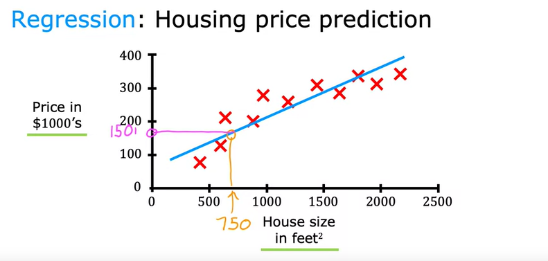

# Intro to Machine Learning

## Supervised Learning

We basically make the algorithms predict certain $X —> Y$ mappings i.e. make algo predict $Y$ when given the input $X$ only.

for training, in Supervised Learning we feed the algorithm the correct mappings as well so it learns how to predict the correct output given only the input

### Some applications of Supervised Learning

| Input | Output | Application |
| --- | --- | --- |
| email | spam? (0/1) | spam filtering |
| audio | text transcripts | speech recognition |
| english | spanish | translation |

**Regression** is a good example of supervised learning in which we try to make a prediction given a certain input, the algo is trained on a dataset and tries to predict a continuous numerical value based on input data.

Prediction of housing prices is an example of regression, in which we are given some data (say area in sq $m^2$) and given a certain area value we have to predict the price of a home. 

Regression achieves this by fitting a curve to a given plot and trying to make that curve as accurate as possible

**Classification** is also a good example of supervised learning, let’s take up the problem of breast cancer detection, an algo is trained on a dataset which has the ‘right answers’ inside it, i.e. confirmed diagnosis of whether a tumor is benign or malignant and then tries to make a judgement given certain input

given certain data (age and size), the trained algo can make a somewhat accurate prediction on whether a tumor is benign or malignant

## Unsupervised Learning

Basically finding out patterns or some structure in a given dataset, taking the example of Breast Cancer detection again, we can be provided with a dataset albeit this time without the confirmed diagnosis data i.e. whether the tumor was malignant or benign. The goal here would be to find some structure or pattern in the data

The algo might decide to club every set of data into say 2 clusters, this is known as a **clustering algorithm.**

another example would be to club similar news together in a news app.

The data comes with input $X$ but not the output $Y$ in Unsupervised Learning, the output must be found out by the algo based on patterns discerned.

- NOTE: classification is supervised, clustering is unsupervised

## Linear Regression Model

we just need to fit a line to our data to best predict some value w.r.t another value given to us, Ex) Housing Prices Prediction same as mentioned above

$X =$ input variable

$Y =$ target variable

$m =$ number of training examples

$(x^i, y^i) =$  $i’th$ training example

Now in order to make this work we need to have a **cost function** and know how it works.

a flowchart representing steps in linear regression, and the equation of line which will fit the data

The model relies on the values of $w$ and $b$ to make an accurate prediction.  $w$ and $b$ are also known as parameters.

### Cost Function (a.k.a Loss function)

A cost function quantifies the error of a model’s predictions. Given values of $w$ and $b$, we get a line to fit our dataset and then we calculate the cost function.

**The goal is to find values of $w$  and $b$ such that the cost function is minimized and our predictions are as close as possible**

A common cost function used in Linear Regression is the Mean Squared Error cost function.

For now, we set  $b=0$ to simplify things. So now the goal will be to minimize $J(w)$.

Now we already have the dataset with correct output values, so we pick different values of $w$ and plot $f_w(x)$ v/s $x$ then we look at the  $y' - y$ values and calculate the value of $J(w)$ and plot it on $J(w)$ v/s $w$ graph

After trying multiple values of $w$ and plotting the $J(w)$ v/s $w$ graph, we can see that $J(w)$  minimizes for some value of $w$

Now we assumed $b=0$ to make things simpler, however the actual cost function is $J(w, b)$ therefore we will get a 3D graph. 

each Ellipse on the contour plot is made up of points which although have different values for w and b, give then exact same value for J(w, b) and there’s a unique line for every such point to fit our dataset

for values which minimize the cost function, we can see that the corresponding line we get will be a good fit to the data

## Gradient Descent

Imagine a parabolic function $f(x)$, we start by picking a random $x$ value, now we don’t know if this value is the minimum or not so we use this equation

$$
x = x - \alpha \frac{\partial f(x)}{\partial x}
$$

If we are on the left side of the function minima, the equation will lead the $x$ to right side and If we are on the right side of the minima the equation will lead $x$ to the left side, eventually the value of x will converge towards the minima

**We use this gradient descent on our parameters $w, b$ and the cost function $J(w,b)$ to calculate their minimum values.**

NOTE: Gradient Descent might lead us to a different minima for more complex functions with multiple local minimas!

importance of learning rate value

derivation of the partial derivatives of the cost function w.r.t to w and b to be used for gradient descent

Now we use this to find out the best values of $w, b$  for our line to best fit the dataset

NOTE: When gradient descent is applied to a convex function it will always yield the global minima

Gradient Descent in Action

This type of Gradient Descent is known as Batch G.D. in which each step of G.D. uses all the training examples

## Linear Regression with Multiple Features

Instead of relying on one variable, our Linear Regression model can also work with multiple variables

Housing Prices Prediction with multiple variables

$x_j = j^(th)$  feature

$n$ = number of features

$x^(i)$ = features of $i$’th training example  

## Vectorization

Now our prediction function will look something like this :-

where **x** and **w** both are vectors representing features and their respective parameters.

## G.D. for Linear Regression with Multiple features

Before moving on to Gradient Descent for Linear Regression with Multiple Features, there’s also a method which is an alternative to G.D. and works solely on Linear Regression called “Normal equation”

Now looking at G.D. for Multiple linear regresssion:-    

## Feature Scaling

We can see that for features with large values, a good model will choose a small parameter value and for features with small values, a good model will choose large parameter values.

**The huge difference in ranges of values of different features can make G.D. slow, to counter this we use Feature Scaling.**

rescaled data will make a more circular contour plot making G.D. faster

There are different ways to do feature rescaling:-

The goal of feature scaling should be to bring all feature values into a similar range

## Checking G.D. for convergence

When picking a learning rate there’s a chance that our G.D. doesn’t converge towards a global minima. To check convergence we can either:-

1. Plot a learning curve $( J(w, b)$ v/s $iterations)$ expecting to see cost function steadily declining and approaching a value as iteration increases
2. Do a automatic convergence test, If $J(w, b)$ decreases by $ε$ (where $ε$ is a very small value) in one iteration, declare convergence

## Classification Model

In a problem related to classification, the output value is limited to certain values. For example:-

| Question | answer |
| --- | --- |
| is this email spam | yes/no |
| is this tumor malignant | yes/no |
| is this transaction fraudulent | yes/no |

questions like these can be answered by classification:-

$0$ → negative class (false/no)

1 → positive class (true/yes)

## Logistic Regression

Taking again the example of classifying a tumor to be malignant/benign, we classify any given data point to one of these i.e. value will be either 0 or 1. So given a dataset we have to find a function which will always give values between 0-1. This is done by the sigmoid function

$$
\sigma(z) = \frac{1}{1 + e^{-z}}
$$

which will always lie between $0$ and 1.

Our prediction function for logistic regression

this function outputs the probability of positive class given a certain input.