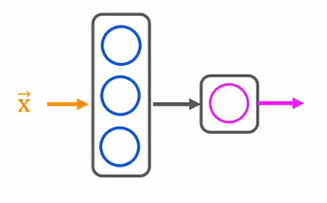

# Advanced Learning Algorithms

## Neural Network Layer

Imagine if we have 4 input features represented by a vector $x$ and we feed them to this neural network:-



the x vector represents the input features, the middle layer is referred to as “hidden layer”, these type of NNs are called “multilayer perceptrons”

Now we see that the hidden layer has 3 neurons and each of these neurons will implement a little logistic regression unit. **Each of the neurons has it’s own weights and bias** $(w_n , b_n)$ and will take in $x$ and will pop out a value $a$ after performing the logistical regression unit, this $a$ is known as an **“activation value”**

NOTE: Logistic regression unit basically means:-

$a = g(z);$   where $g(z)$  is the sigmoid function and $z$ $= dot(w, x) + b$

Now each of these neurons will output a value between $0-1$ and we will get a vector of activation values which is then passed to the final output layer and once again logistic regression is performed on the vector passed to get one final output value between $0-1$.


$a^{[l]}_j = g(w^{[l]}_j · a^{[l-1]} + b^{[l]}_j)$   represents the activation value of the $j^{th}$ neuron in $l^{th}$ layer

## Forward Propagation

Let’s look at the Handwritten Digit Recognition Problem


We have a 8x8 image with each pixel having a value between 0-255 representing the brightness of that pixel, the aim is to have a black and white image of number written on an 8x8 grid

Now we are given 64 pixels meaning 64 input features lets feed it to a NN.


Then $a^{[1]}$  is fed to layer 2 and we get $a^{[2]}$ which is fed to layer 3 and we finally get a number $a^{[3]}$ between $0-1$ which represents the probability of the written number being 1. This Algorithm is called **“forward propagation”** propagating the activation values from left to right.

## Implementations

Let’s take the example of Coffee Roasting. We have two measures Temperature and Duration, when we plot the Temp v/s Duration Graphs we will have some roasts resulting in good coffee and some resulting in bad coffee


Inference in Tensorflow

```python
import tensorflow
import numpy as np

x = np.array([[200, 17]...])
layer_1 = Dense(units=3, activation='sigmoid')
a1 = layer_1(x)

layer_2 = Dense(units=1, activation='sigmoid')
a2 = layer_2(a1)

# yhat is binary (good/bad)
if a2 >= 0.5:
	yhat = 1
else:
	yhat = 0
```

A few things to note are:-

1. data must be fed to tensorflow in the form of matrices

```python
import numpy as np
matrix = np.array([[1, 2], [2, 3], [3, 4]])   # A 3x2 Matrix

# the double [[]] is necessary to represent matrices
```

1. the output of the Dense function in tensorflow is a Tensor and not a matrix/array

```python
import tensorflow

layer_2 = Dense(units=1, activation='sigmoid')
a2 = layer_2(a1)    # say has a value of [[0.8]] --> Tensor

tf.Tensor([[0.8]], shape=(1,1), dtype=float32)
```

### Building our own Neural Networks

Let’s take the example of handwritten digit classification once again, here’s how to code it.

```python
import tensorflow as tf
from tensorflow.keras import Sequential
from tensorflow.keras.layers import Dense
from tensorflow.keras.losses import BinaryCrossentropy

model = Sequential([
	Dense(units=25, activation='sigmoid'),
	Dense(units=15, activation='sigmoid'),
	Dense(units=1, activation='sigmoid'),
									])
									
model.compile(loss=BinaryCrossentropy())
model.fit(X,Y, epochs=100)
```

The loss parameter signifies which loss function to use, epochs basically refers to the steps in gradient descent.

## Activation Functions


we can use multiple different activation functions to use in our NN

## Multiclass

Now if we take up the problem of handwritten digit classification again, we might need to predict multiple numbers. Now this time $y$ can’t just be a singular binary value.


### Softmax Regression


Softmax Regression is a general case of linear regression


every $a$ value (predicted value) represents the probability of $y$ (target value) being the class and is represented by:- 

$$
a_N = \frac{e^{z_N}}{\sum_{j=1}^N e^{z_j}}
$$

Softmax regression is a generalization of logistic regression that can handle multiple classes. Here are the key points:

- It takes input features and produces probability distributions across N different classes
- The softmax function ensures all probabilities are between 0 and 1 and sum to 1
- For each class, it computes $z_j = w_j·x + b_j$ and then applies the softmax formula
- The output is a vector of probabilities where the highest probability indicates the predicted class

In neural networks, softmax is typically used as the activation function in the output layer for multiclass classification problems. The model learns the optimal weights and biases during training to make accurate predictions across all classes.

NOTE: 

Tensorflow has two potential formats for target values and the selection of the loss defines which is expected.

- SparseCategorialCrossentropy: expects the target to be an integer corresponding to the index. For example, if there are 10 potential target values, y would be between 0 and 9.
- CategoricalCrossEntropy: Expects the target value of an example to be one-hot encoded where the value at the target index is 1 while the other N-1 entries are zero. An example with 10 potential target values, where the target is 2 would be [0,0,1,0,0,0,0,0,0,0].


```python
# NAIVE IMPLEMENTATION FROM THE LECTURE (NOT RECOMMENDED)

import tensorflow as tf
from tensorflow.keras import Sequential
from tensorflow.keras.layers import Dense

model = Sequential([
					Dense(units=25, activation='relu'),
					Dense(units=15, activation='relu'),
					Dense(units=10, activation='softmax')
									])
									
from tensorflow.keras.losses import SparseCategoricalCrossentropy
model.compile(loss=SparseCategoricalCrossentropy())
model.fit(X, Y, epochs=100)
```

### Improved implementation of softmax

```python
import tensorflow as tf
from tensorflow.keras import Sequential
from tensorflow.keras.layers import Dense

model = Sequential([
					Dense(units=25, activation='relu'),
					Dense(units=15, activation='relu'),
					Dense(units=10, activation='linear')
									])
									
from tensorflow.keras.losses import SparseCategoricalCrossentropy
model.compile(loss=SparseCategoricalCrossentropy(from_logits=True))
model.fit(X, Y, epochs=100)

logits = model(X)
f_x = tf.nn.softmax(logits)
```

with the `from_logits = True` and applying no activation function to the output layer we directly receive logits. 

Logits are the raw output values from the neural network before applying any activation function like softmax. They are essentially the $z$ values that go into the softmax function. Using logits directly and applying softmax later is numerically more stable and can lead to better training performance.)

### Multi-label classification

The key difference between multinomial logistic regression and multi-label classification is that in the former, we have a single prediction from multiple classes (Example: handwritten digit classification → single prediction) however in the latter, we might classify the input into multiple categories (Example: movie genre classification, a movie can lie in multiple genres → multiple predictions from an input)

In this case, we will have an output vector with multiple probabilities, think of it as multiple binary classification problems pieced together.


a trained NN, detecting the presence of either a car, bus or pedestrian in an image.

## Additional Concepts

### Advanced Optimization


each weight gets a unique learning rate for itself


To implement this in code:-

```python
model.compile(optimizer=tf.keras.optimizers.Adam(learning_rate=1e-3))
```

### Additional Layer Types

Apart from the Dense layer, which takes in activation values from the previous layer. We also have a type of layer called “Convolutional Layer” in which each neuron of a layer only looks at a portion of the previous layer’s outputs (faster computation, reduces risk of overfitting). These Convolutional Layers are the basis of Convolutional Neural Networks (CNN).

## Test, Train and Cross-validation datasets

When working with machine learning models, it's crucial to split your dataset into different parts to properly evaluate the model's performance and prevent overfitting. These parts are:

- **Training Dataset:** The largest portion of data used to train the model. The model learns patterns and adjusts its parameters using this data.
- **Validation Dataset (Cross-validation):** Used during training to tune hyperparameters and assess model performance. Helps prevent overfitting by providing an unbiased evaluation while still allowing for model adjustments.
- **Test Dataset:** A completely separate portion of data used only after training is complete to evaluate the model's final performance. This data is never used during training to ensure an unbiased assessment of how well the model generalizes.

This separation is crucial because testing on the same data used for training can give overly optimistic results and hide problems like overfitting, where the model performs well on training data but fails to generalize to new, unseen data.

NOTE: When scaling the entire dataset, cross-val dataset must also be scaled as per the training set (Example, in case of z-score normalization the $\mu$  and $\sigma$ of cross-val dataset must be the same as of training set)

You will scale the cross validation set below by using the same `StandardScaler` you used earlier but only calling its [`transform()`](https://scikit-learn.org/stable/modules/generated/sklearn.preprocessing.StandardScaler.html#sklearn.preprocessing.StandardScaler.transform) method instead of [`fit_transform()`](https://scikit-learn.org/stable/modules/generated/sklearn.preprocessing.StandardScaler.html#sklearn.preprocessing.StandardScaler.fit_transform).


## Decision Trees
