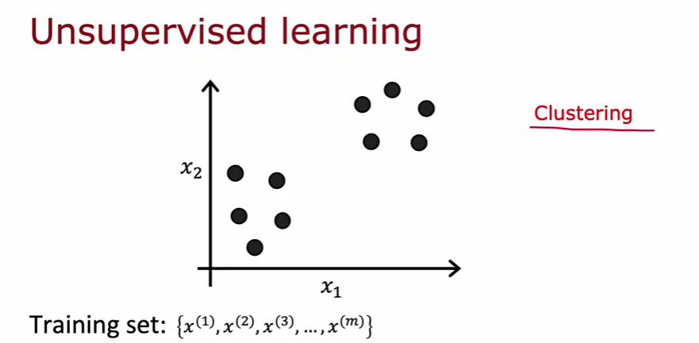
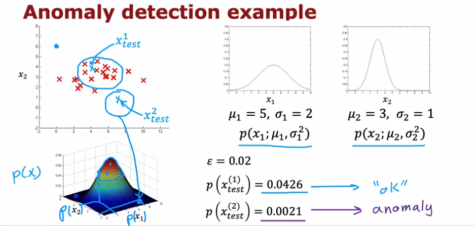

# Unsupervised Learning

## Clustering

Unlike Binary Classification, Clustering is an unsupervised learning algorithm.  A Clustering algorithm figures out if the current data we have can be divided into “clusters” or groups.



## K-means clustering

In this algorithm we make a prediction for each cluster centroid. Then we associate each point with the cluster centroid closest to it


Then move the cluster centroid to the average co-ordinates of the points associated with that cluster centroid. So the initially randomly guessed cluster centroids go to their actual positions.


### K-means Algorithm

1. Randomly Initalize $K$ cluster centroids ${\mu}_1, {\mu}_2 ... {\mu}_k$
2. Assign points to the cluster centroids
3. Move cluster centroids: average of points assigned to cluster $k$

### K-means optimization


The cost function for the K-means algorithm is the mean squared average of the distances between each training example and the centroid associated to it.

This cost function is known as the Distortion function.

NOTE: Every single step of K-means algorithm leads to convergence.

### Initialization of K-means

Choose $K < m$

A common method is just to pick $K$ random training examples and proceed. But just like G.D. our Distortion cost function can fall into the trap of sub-optimal local minimas :(


We can end up with different clusterings, some of them not being optimal. Just look at the value of the cost function $J$ to figure out which clustering is the best.


### Picking the number of clusters


Elbow method of picking K

Pick that value of $K$ for which the cost function $J$ stops decreasing rapidly.


sometimes it just depends

### K-means practice lab code

```python
def find_closest_centroids(X, centroids):
    """
    Computes the centroid memberships for every example
    
    Args:
        X (ndarray): (m, n) Input values      
        centroids (ndarray): (K, n) centroids
    
    Returns:
        idx (array_like): (m,) closest centroids
    
    """

    # Set K
    K = centroids.shape[0]

    # You need to return the following variables correctly
    idx = np.zeros(X.shape[0], dtype=int)

    ### START CODE HERE ###
    for ex, i in zip(X, range(X.shape[0])):
        
        closest_centroid_number = 0
        min_dist = (abs(ex[0] - centroids[0][0]))**2 + (abs(ex[1] - centroids[0][1]))**2
        
        for j in range(1, centroids.shape[0]):
            dist = (abs(ex[0] - centroids[j][0]))**2 + (abs(ex[1] - centroids[j][1]))**2
            if dist < min_dist:
                min_dist = dist
                closest_centroid_number = j
        
        
        idx[i] = closest_centroid_number
     ### END CODE HERE ###
    
    return idx
```

```python
def compute_centroids(X, idx, K):
    """
    Returns the new centroids by computing the means of the 
    data points assigned to each centroid.
    
    Args:
        X (ndarray):   (m, n) Data points
        idx (ndarray): (m,) Array containing index of closest centroid for each 
                       example in X. Concretely, idx[i] contains the index of 
                       the centroid closest to example i
        K (int):       number of centroids
    
    Returns:
        centroids (ndarray): (K, n) New centroids computed
    """
    
    # Useful variables
    m, n = X.shape
    
    # You need to return the following variables correctly
    centroids = np.zeros((K, n))
    
    ### START CODE HERE ###
    for i in range(K):
        
        centroid_coord = np.zeros(n)
        num_of_assigns = 0
        
        for ex, centroid_idx in zip(X, idx):
            if centroid_idx == i:
                centroid_coord += ex
                num_of_assigns += 1
        
        centroids[i] = centroid_coord/num_of_assigns
    ### END CODE HERE ## 
    
    return centroids
```

# Anomaly detection

Looking at unlabeled data and figuring out anomalies. Say we are trying to detect fault aircraft engines by looking at 2 features, $x_1$ being the heat generated by the engine, $x_2$ being the vibrational intensity.


We can usse something called Density Estimation to predict how likely are the test values to be seen in the datatset.


if the probability of the test value being seen in the dataset is $p(x_{test})$ and the threshold to detect anomalies is $\epsilon$ then:

$$
p(x_{test}) < \epsilon : anomaly
$$


## Gaussian Distribution


here’s how the distribution looks with different values of variance and mean


We calculate the relevant parameters for our Bell curve and plot it, then we take the test value and fit it into the bell curve. If the value has a low $p(x)$ then we can say it’s anomalous


So here are the steps:-




## Evalution of Anomaly Dectection Algorithm

NOTE:

1. Train set: we train our algorith/model on this, it learns from this data
2. Cross-Validation: “hey, bro am I doing good?” set. Will keep testing on this every iteration to figure out if the algorithm/model is going in the right direction or not by calculating some number (real-number evaluation or loss function) and using that to evaluate the algo
3. Test set: Final set we test on

We can do this split for our Anomaly Detection Algorithm as well. 


While training on the good examples of the training set, we can cross-check with the CV set and tune our parameters $\epsilon$ and check the features we are using.

And in the case if we have very few anamalous examples in our dataset, we can just opt not to use a test set.

## Anomaly Detection v/s Supervised Learning


In Anamoly detection our goal is to classify anything which isn’t similar to what we have seen as an anamoly but if were to use Supervised learning there is a chance that our trained model could make a wrong prediction.


## Choosing Features

Choosing the correct features is very important for Anamoly detection.

### Non-Gaussian Features

In some cases, when we plot our features they might be non-gaussian. Hence, we can try to make them Gaussian.

NOTE: ANY TRANSFORMATIONS APPLIED TO THE TRAINING SET MUST BE APPLIED TO CV AND TEST SET AS WELL


### Error Analysis

In the case the probability density for anamalous and normal examples are comparable, we can add more features or take context into account

Example instead of using $p(x)$ it might be better to use $p(x|c)$ 


In this particular example, both high CPU Load and Low Network Traffic aren’t problems however having a high CPU load even though the network traffic is low is a reason for suspiscion. So we make a new feature.
